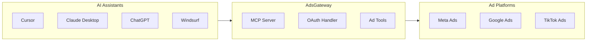
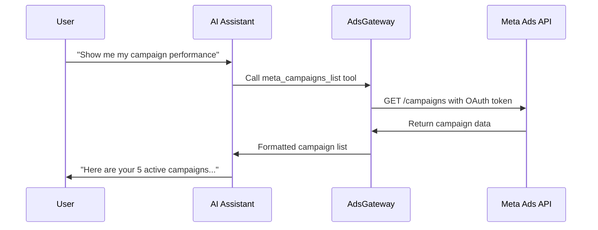

# How AdsGateway Works

AdsGateway acts as a secure bridge between your AI assistants and advertising platforms. Here's how the pieces fit together.

## Architecture Overview

## The Connection Flow

<Steps>
  <Step title="AI Assistant Connects">
    When you add AdsGateway to your AI assistant (like Cursor), it connects to our MCP (Model Context Protocol) server. MCP is an open standard that allows AI tools to securely connect to external services.
  </Step>
  
  <Step title="You Authenticate">
    The first time you use AdsGateway, you'll be prompted to log in. This creates a secure session and allows you to connect your ad platforms.
  </Step>
  
  <Step title="Ad Platform Authorization">
    When you connect an ad platform like Meta, you authorize AdsGateway to read your advertising data. We use OAuth, the industry standard for secure authorization.
    
    <Info>
      AdsGateway only requests read access to your ad accounts. We cannot create, modify, or delete your ads or campaigns.
    </Info>
  </Step>
  
  <Step title="Tools Become Available">
    Once connected, your AI assistant gains access to AdsGateway tools. These tools let you query your ad data using natural language.
  </Step>
  
  <Step title="You Ask Questions">
    When you ask a question like "What was my spend yesterday?", your AI assistant:
    1. Interprets your question
    2. Calls the appropriate AdsGateway tool
    3. Receives the data
    4. Formats it into a helpful response
  </Step>
</Steps>

## Security & Privacy

<CardGroup cols={2}>
  <Card title="OAuth Authentication" icon="shield-check">
    We use OAuth 2.1, the latest security standard, for all authentication. Your ad platform credentials are never stored by AdsGateway.
  </Card>
  <Card title="Read-Only Access" icon="eye">
    AdsGateway only reads your advertising data. We cannot make changes to your campaigns, ads, or account settings.
  </Card>
  <Card title="Encrypted Connections" icon="lock">
    All data is transmitted over HTTPS with TLS 1.3 encryption. Your data is never exposed in transit.
  </Card>
  <Card title="No Data Storage" icon="database">
    We don't store your advertising data. Each request fetches fresh data directly from the ad platform.
  </Card>
</CardGroup>

## What is MCP?

MCP (Model Context Protocol) is an open standard developed by Anthropic that allows AI assistants to securely connect to external tools and data sources.

<Accordion title="Learn more about MCP">
  MCP provides:
  
  - **Standardized tool definitions**: AI assistants understand what tools are available and how to use them
  - **Secure authentication**: OAuth-based auth ensures only authorized users can access data
  - **Structured responses**: Data is returned in formats that AI can easily interpret and present
  
  AdsGateway implements MCP to ensure compatibility with a wide range of AI assistants including Cursor, Claude Desktop, and more.
</Accordion>

## Data Flow Example

Here's what happens when you ask "Show me my campaign performance":

## Available Tools

AdsGateway provides 11 tools for Meta Ads:

| Category | Tools | Description |
|----------|-------|-------------|
| **Account** | `meta_accounts_list`, `meta_accounts_select`, `meta_context_get` | Manage which ad account you're working with |
| **Data** | `meta_campaigns_list`, `meta_adsets_list`, `meta_ads_list`, `meta_ad_get`, `meta_insights_get` | Fetch campaigns, ad sets, ads, and performance metrics |
| **Analysis** | `meta_analysis_summary`, `meta_analysis_top_movers`, `meta_analysis_anomalies` | AI-powered insights and anomaly detection |

<Card title="Explore All Tools" icon="arrow-right" href="/tools/account-management">
  See detailed documentation for each tool
</Card>
